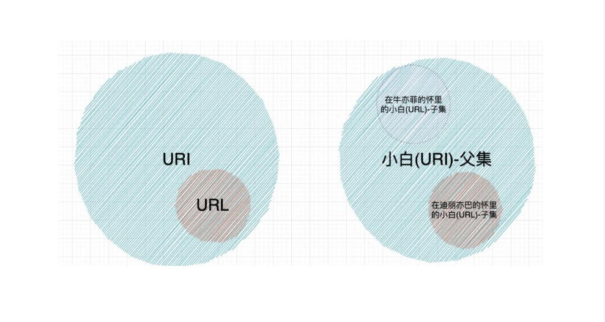

## 计算机网络基础-1
### 1. http协议 请求头和响应头
  请求头（Request Header）
  Host ：主机ip地址或域名
  User-Agent ：客户端相关信息，如果操作系统、浏览器等信息
  Accept ：指定客户瑞接收信息类型，如: image/jpg, text/html, application/json
  Accept-Charset ：客户端接受的字符集，如Igb2312、1s0-8859-1
  Accept -Encoding ：可接受的内容编码，如gzip
  Accept - Language 接：受的语言，如Accept-Language :zh-cn
  Authorization ：客户端提供给服务端，进行权限认证的信息
  Cookie ：携带的cookie信息
  Referer :当前文档的URL,即从哪个链接过来的
  Content-Type :请求体内容类型，如content-Type: application/x-ww- form-urlencoded
  Content - Length :缓存机制，如cache-Control :no-cache
  Cache -Control :缓存机制，如cache-Control :no-cache Pragma 防止页面被缓存，和ICache-Control:no-cache作用 -样
  响应头
    Server ：服务器相关信息
    Date ：服务器时间
    Content-Type ：响应体内容类型，如content-Type: application/json
    Content-Length ：响应体长度
    Content-Encoding ：响应体编码，如gzip
    Content-Language ：响应体语言，如Content-Language :zh-cn
    Set-Cookie ：设置cookie
    Expires ：缓存机制，如Expires: -1
    Cache-Control ：缓存机制，如Cache-Control: no-cache
    Last-Modified ：缓存机制，如Last-Modified: Fri, 21 Dec 2018 11:00:00 GMT
    ETag ：缓存机制，如ETag: "686897696a7c876b7e"
    Location ：重定向地址
    WWW-Authenticate ：服务器认证信息
    Connection ：连接状态，如Connection: keep-alive

### 2. 例题
1 Cookie是请求字段,Referer 是当前文档的URL 就是从那个链接过来的
2 Etag是响应头 ,对于资源的标识符
3 Location用来重定向资源在创建新资源的时候使用
4 url四类地址,1-128 128-191 192-223 224-239 240-255
5 127.0.0.1 是一个本地地址,不是作为互联网可以使用的ip地址 除此之外还有
0.0.0.0: 保留地址
255.255.255.255:广播地址
169.254.x.x 自动私有地址
192.0.2.0 - 192.0.2.255: 这是一个保留的IPv4地址范围，用于文档和示例目的。它并不用于实际的互联网通信，而是用于教育、测试和文档编写等场景
6 确认序列号
7 服务和默认端口号以及描述
HTTP (Hypertext Transfer Protocol): 80

用于在Web浏览器和Web服务器之间传输超文本文档。
HTTPS (HTTP Secure): 443

用于在Web浏览器和Web服务器之间通过加密通信传输超文本文档。
FTP (File Transfer Protocol): 20 (数据传输) 和 21 (控制连接)

用于在客户端和服务器之间传输文件。
SSH (Secure Shell): 22

用于安全远程登录和执行命令。
Telnet: 23

用于远程登录到远程主机。
SMTP (Simple Mail Transfer Protocol): 25

用于电子邮件的发送。
POP3 (Post Office Protocol version 3): 110

用于接收电子邮件。
IMAP (Internet Message Access Protocol): 143

用于接收和管理电子邮件。
DNS (Domain Name System): 53

用于将域名解析为IP地址。
DHCP (Dynamic Host Configuration Protocol): 67 (服务器) 和 68 (客户端)

用于自动分配IP地址和其他网络配置参数。

### 3 书记
1 URL是啥,就是统一资源定位符,是用来标识互联网上资源的地址
2 URL和URi的区别
URL 统一资源定位符,是URI的子集,URI是统一资源标识符

# 1IP层会分片,为啥tcp也分片

1.1
数据先到传输层再到网络层,再传输层叫**分段**再网络层IP叫**分片**
TCP长度是MSS
IP长度是MTU

MSS：Maximum Segment Size。TCP提交给IP层最⼤分段⼤⼩，不包含TCP Header和TCPOption，只包含TCP Payload，MSS是TCP⽤来限制应⽤层最⼤的发送字节数。假设MTU= 1500 byte，那么MSS = 1500- 20(IP Header) -20 (TCP Header) = 1460 byte，如果应⽤层有2000 byte发送，那么需要两个切⽚才可以完成发送，第⼀个TCP切⽚= 1460，第⼆个TCP切⽚= 540。
1.2
TCP三次握手,MSS会再三次握手的时候传递给对方,用来通知本地可以最大接受的TCP报文数据

其实MSS是作为可选项引⼊的，只不过⼀般情况下MSS都会传，但是万⼀遇到了哪台机器的实现上⽐较调⽪，不传MSS这个可选项。那对端该怎么办？如果没有接收到对端TCP的MSS，本端TCP默认采⽤MSS=536Byte。那为什么会是536？
前⾯提到了IP会切⽚，那会切⽚，也就会重组，⽽这个576正好是IP最⼩重组缓冲区的⼤⼩。

# 2localhost和0.0.0.0的区别
localhost不叫ip它是一个域名,默认的时候是没区别的
ping 0.0.0.0是会失败的,因为IPV4是无效地址

# 3连接⼀个IP不存在的主机时，握⼿过程是怎样的？
3.1三次握手

链接一个IP不存在的主机的时候,握手过程是咋样的

